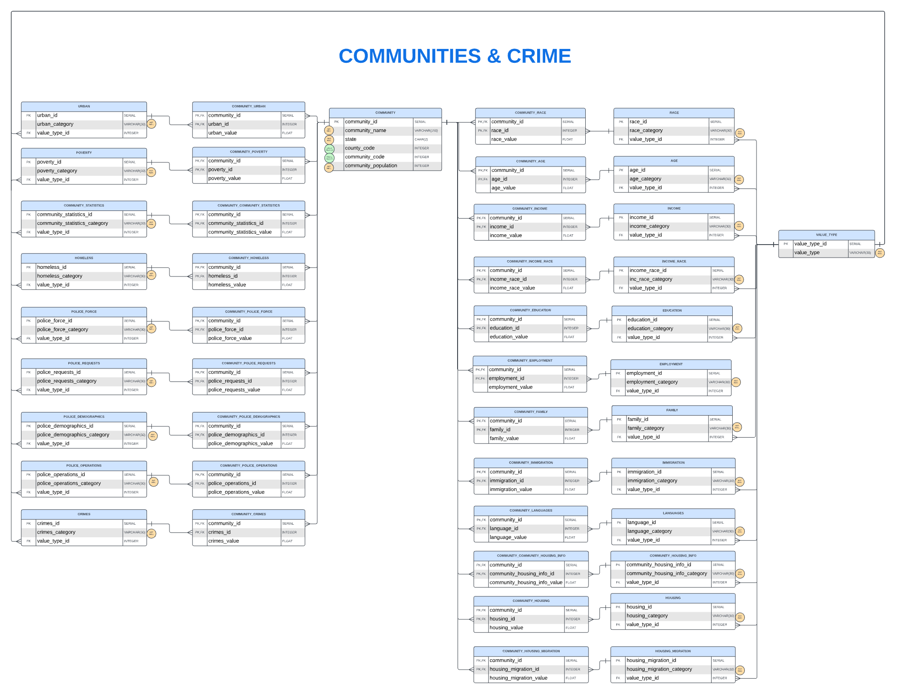
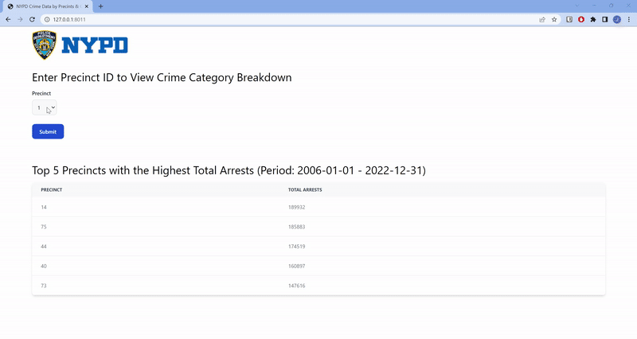
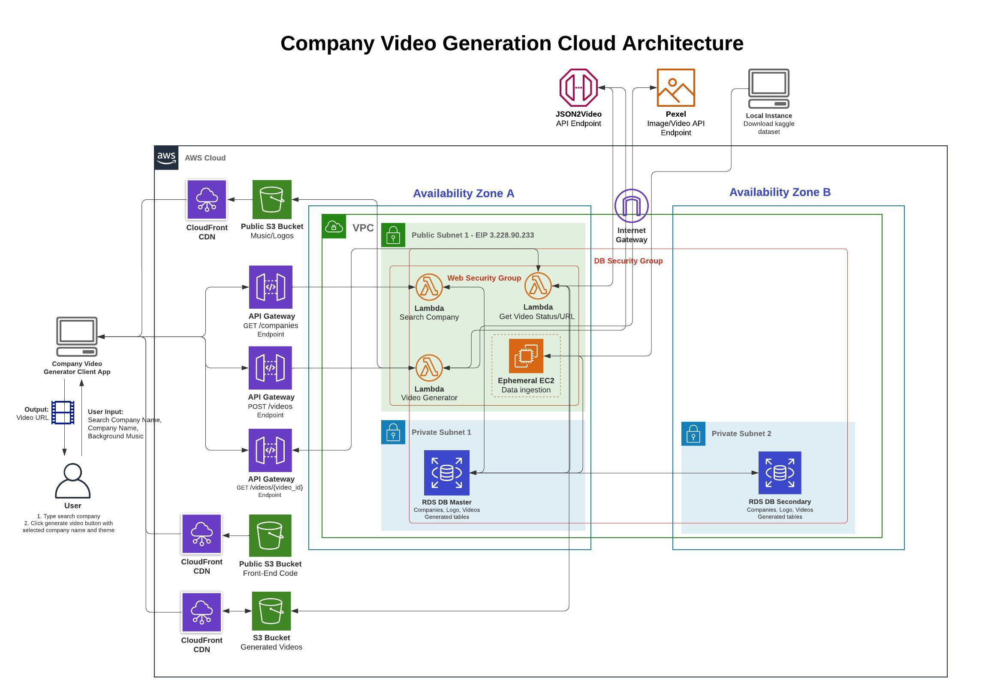

## Portfolio of Projects
---
### Incentivizing CitiBike Angels to Rebalance Bikes in NYC
#### Optimizing CitiBike Angel Routes for Longer Distances with Tableau

CitiBike, a popular bike-sharing program in NYC, relies on the support of Bike Angels - dedicated users who contribute to the system's efficiency by rebalancing bikes across locations. However, the current system faces challenges, primarily optimizing for short-distance rebalancing jobs, which may not align with the preferences of Bike Angels seeking more rewarding experiences.

Problem Statement:
The existing CitiBike app prioritizes short-distance rebalancing (Trip Chaining), leading to less appealed Bike Angels.
Short-distance incentives do not motivate Bike Angels to engage in larger-scale rebalancing efforts.
There's a lack of a planning mechanism for Bike Angels to undertake longer distance rebalancing trips.

Solution:
We created a data visualization on Tableau to provide the following outcomes:
1. Provide users with historical information on the usage trends of CitiBike riders to visualize "hotspots", peak times when bikes are required at specific locations
2. Display the density of empty CitiBike docks, so Angel riders can also use this information to rebalance bikes

[Read more about the project here](pdf/Citibike_AngelMapper.pdf)

[View the dashboard on Tableau Reader](files/citibike_angels.twbx)

### Unveiling Insights for Safer Communities
#### Database Normalization and Metabase Visualization 
 

The goal of this project is to leverage advanced SQL techniques to normalize a comprehensive US Communities & Crimes dataset, facilitating the extraction of meaningful insights. By employing relational database normalization, the project aims to enhance data integrity and streamline information retrieval for analytical purposes.

The overarching objective is to empower the US government in the pursuit of reducing crime rates by formulating informed policies and optimizing resource allocation. The project recognizes the multifaceted benefits to society, highlighting correlations such as the potential impact of a 10% decrease in homicides on increasing housing values by 0.83%.

The project caters to distinct audiences:

1. Analytical Audience: This group possesses the skills to directly access and query the normalized dataset. They can delve into the intricacies of the data to derive specific insights that inform targeted interventions.

2. Managers / C-Suite Audience: For those at the managerial and executive levels, the project provides a high-level overview through interactive visualizations. This approach ensures that even individuals without a technical background can grasp the findings easily, enabling them to make informed decisions for policy formulation and resource allocation.

By combining the power of normalized relational databases with intuitive visualizations on Metabase, the project aims to be a catalyst in the ongoing efforts to create safer communities, demonstrating how data-driven insights can drive positive societal changes.

<iframe width="560" height="315" src="https://www.youtube.com/embed/zQUjgzA4okA?si=JLHUbxQ4Zj-qtArx" frameborder="0" allowfullscreen></iframe>

[View the project on GitHub](https://github.com/joycemegumi/US-Communities-Crimes)

### Designing an Experimental Study on Customer Engagement on Instagram Shop
     

Instagram has helped businesses and entrepreneurs build their digital storefronts through its shopping feature and has allowed users to shop easily. In this project, my team sought to learn what type of features increase users' average daily session time on Instagram’s shop feed by designing a hypothetical experiment and conducting simulated studies. The attributes studied were exposure to product categorization, creator product curation, and price and description in the feed. 

A one-way analysis of variance test with the Tukey’s Honest Significant Difference (HSD) correction was conducted to evaluate the effect of each treatment group in comparison to the control group to review if a significant effect size was present.

[View Project](https://joycemegumi.github.io/research-design-project)

---
### Optimizing NYPD Resource Allocation
#### Unveiling Insights Through an ETL Pipeline with NYC Open Data API, PostgreSQL, Apache Spark, and Flask
    

In response to the surge in major crime rates in NYC, our team developed a web application tool aimed at mitigating this issue. We designed and implemented a robust ETL pipeline to curate essential data, which served as the foundation for developing a web application tailored for NYPD officials. This dynamic tool not only identifies precincts with elevated crime rates, but also highlights those with a disproportionate incidence of major crimes. 

By utilizing the NYC Open Data API, PostgreSQL, Apache Spark, and Flask, we've created a powerful solution empowering officials to strategically allocate NYPD resources, ultimately fostering informed decision-making for safer communities.

[View the Code on GitHub](https://github.com/joycemegumi/Managing-Data-Project)

### Automating Content Creation with a AWS Serverless Architecture
#### Transforming a 2 Million+ Companies Dataset into Dynamic Video Presentations
     

Manual content creation involves extensive time and effort by video editors that need to search for video assets, apply copy, styling etc. This process can be time-consuming and may lead to delays in delivering timely content to customers, potentially missing valuable opportunities.

In this project my team built a company video generator web application based on companies datasets from Kaggle. This cutting-edge platform will allow users to effortlessly generate videos by simply selecting their company name and desired theme by leveraging the integration of the [JSON2Video API](https://json2video.com/) and [Pexel API](https://www.pexels.com/api/).

Benefits :
* Cost and time efficiency in content creation.
* Enabling non-technical users to create videos.

#### Generating New Video

<iframe width="560" height="315" src="https://www.youtube.com/embed/qe13jgi8Dv4" frameborder="0" allowfullscreen></iframe>

#### Generate an Existing Video

<iframe width="560" height="315" src="https://www.youtube.com/embed/1GhVirfRe0Q" frameborder="0" allowfullscreen></iframe>

[View the Web Application](https://frontendcodegroup2.s3.amazonaws.com/videogenerator.html)

[View the presentation on Canva](https://www.canva.com/design/DAFr0hoDX14/3IRODlYJekxRvXHBT6kVJA/view?utm_content=DAFr0hoDX14&utm_campaign=designshare&utm_medium=link&utm_source=publishsharelink)

[View the project on GitHub](https://github.com/joycemegumi/Comapny-Video-Generator)